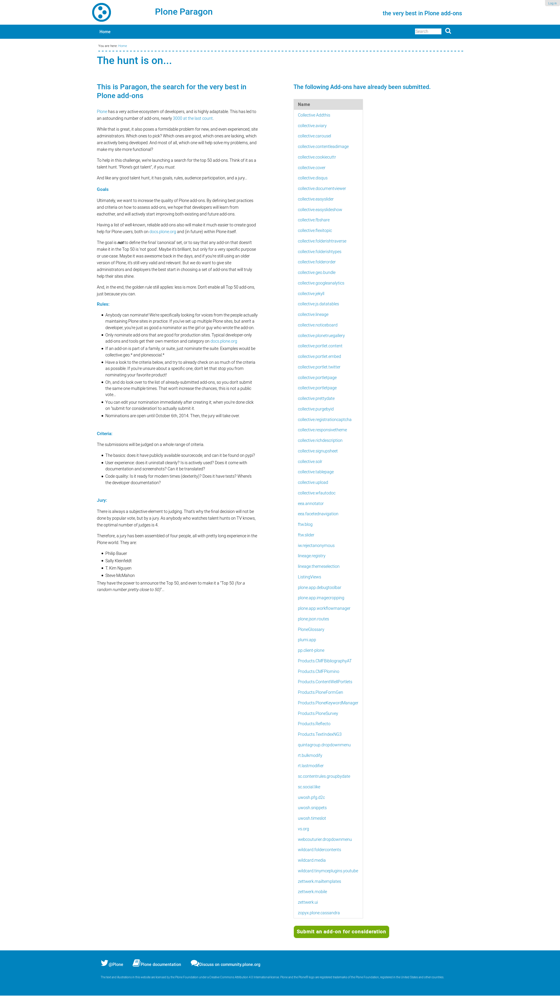

=============
paragon.site
=============

:About: paragon.plone.org

**This project is deprecated for more info see https://plone.org/community/paragon-project**

Configuration
=============

Installation
------------

Download the Universal Installer:

.. code-block:: console

   wget https://launchpad.net/plone/4.3/4.3.3/+download/Plone-4.3.3-UnifiedInstaller.tgz

Unpack:

.. code-block:: console

   tar -zxvf Plone-4.3.3-UnifiedInstaller.tgz

Change into directory:

.. code-block:: console

   cd Plone-4.3.3-UnifiedInstaller

Run installer:

.. code-block:: console

   ./install.sh

With your usual preferred option (do ./install.sh --help for options)

Then, copy all files from the docs/ directory here into your buildout,
overwriting the buildout.cfg that the universal installer generated.

Change secret.cfg as required.

Run bin/buildout, and you should be on your merry way.

Preview
=======

